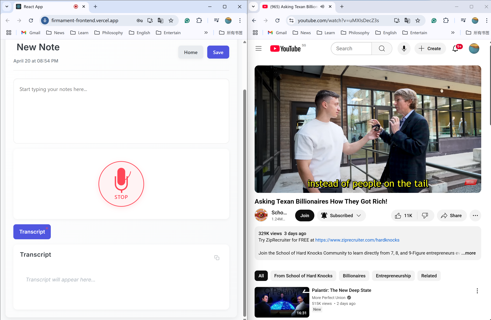
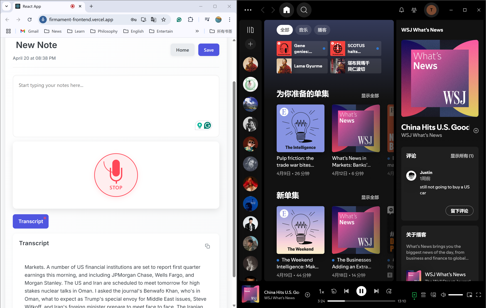

# Real-time Speech Transcription App

A full-stack application for real-time speech transcription using Deepgram's speech-to-text API. The app features user authentication, persistent sessions, and high-quality transcription.

## Live Demo

**Live Demo:** [https://firmament-frontend.vercel.app](https://firmament-frontend.vercel.app)

**Test Account:**
- Email: a@firmament
- Password: 123456

## Features

- Real-time speech-to-text transcription
- User authentication and session management
- Microphone control with visual feedback
- Responsive design
- Persistent user sessions
- Stable WebSocket connections

## Tech Stack

- **Backend**: Flask, Flask-SocketIO, Deepgram API
- **Frontend**: React.js
- **Authentication**: Simple user authentication
- **Deployment**: Vercel (frontend), Render (backend)

## ⚠️ Audio Compatibility Guide ⚠️

Due to browser limitations on simultaneous audio input/output handling:

### ❌ Not Supported (Will Not Work)
- Using the same browser to record audio **AND** play video content (YouTube, Netflix, etc.)
- Running the transcription app alongside any video streaming service in the same browser
- Any scenario where microphone recording and video playback happen in the same browser instance


*Example: Attempting to use transcription alongside YouTube in the **same** browser results in "No Transcription"*

### ✅ Supported Scenarios
- **Multi-Browser Solution**: Use Chrome for the transcription app and Edge for video playback
- **App + Podcast Streaming**: Using the transcription app while playing Podcast in Spotify (separate application)
- **Cross-Device**: Recording on your computer while playing videos on a separate device


*Example: Successfully transcribing audio using **Chrome** for the app and **Spotify** for a podcast.*

### 💡 Recommended Setup
- For meetings/lectures: Use our app in Chrome with no other audio sources
- For transcribing videos: Use two browsers (e.g., Chrome for our app, Firefox for videos)
- For podcast transcription: Use our app alongside the Spotify desktop application

## Installation

### Prerequisites

- Python 3.8+
- Node.js 14+
- Deepgram API key

### Backend Setup

1. Clone the repository
2. Set up a Python virtual environment:
   ```
   cd backend
   python -m venv venv
   source venv/bin/activate  # On Windows: venv\Scripts\activate
   pip install -r requirements.txt
   ```
3. Create a `.env` file in the backend directory with your Deepgram API key:
   ```
   DEEPGRAM_API_KEY=your_key_here
   ```

### Frontend Setup

1. Install dependencies:
   ```
   cd frontend/dev
   npm install
   ```

## Running the Application

1. Start the backend servers:
   ```
   # Terminal 1 - HTTP Server
   cd backend
   python app.py
   
   # Terminal 2 - WebSocket Server
   cd backend
   python app_socketio.py
   ```

2. Start the frontend development server:
   ```
   cd frontend/dev
   npm start
   ```

3. Access the application at http://localhost:3000

## Usage

1. Log in with the test credentials (welcome@firmament.com / 123456)
2. Click the microphone button to start recording
3. Speak into your microphone to see real-time transcription
4. Click the microphone button again to stop recording
5. Use the logout button to end your session

## Architecture

The application consists of three main components:

1. **HTTP Server (app.py)**: Handles authentication and serves static content
2. **WebSocket Server (app_socketio.py)**: Manages real-time audio streaming and Deepgram integration
3. **React Frontend**: Provides the user interface for login, audio recording, and transcription display

## Deployment

The application is deployed using:
- **Frontend**: Vercel ([https://firmament-frontend.vercel.app](https://firmament-frontend.vercel.app))
- **Backend API**: Render (https://firmament-api.onrender.com)
- **WebSocket Server**: Render (https://firmament-socketio.onrender.com)

## Session Management

The application uses a persistent user ID system to maintain stable connections across page reloads and reconnections. User IDs are:

1. Generated at login time
2. Stored in localStorage
3. Sent with each WebSocket connection
4. Used to track Deepgram connections on the server

## Troubleshooting

If you encounter issues with transcription:

1. Check browser microphone permissions
2. Ensure your Deepgram API key is valid
3. Verify both backend servers are running
4. Check the browser console for errors
5. Examine the server logs for WebSocket or Deepgram errors
6. **Audio Not Transcribing?** 🔊 Make sure you're not playing videos in the same browser (see [Audio Compatibility Guide](#️-audio-compatibility-guide-️) above)

## License

This project is licensed under the MIT License - see the LICENSE file for details.
